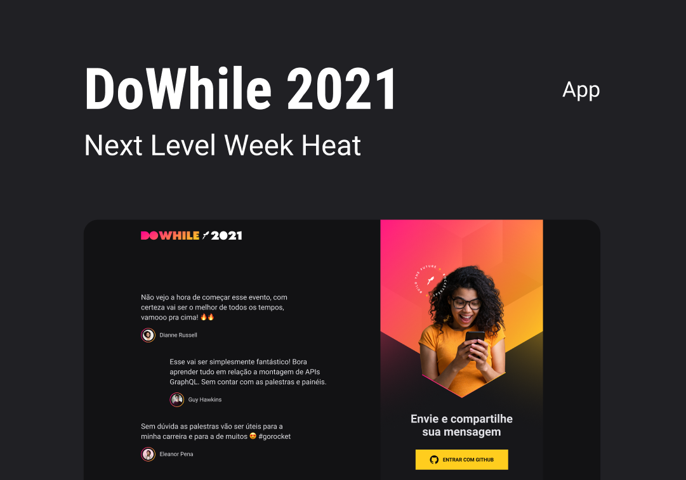

<h1 align="center">
  
</h1>

 

  

## 🚀 NLW Heat 2021 - DO WHILE

Esse projeto foi desenvolvido durante a semana do evento [DO WHILE 2021](https://nextlevelweek.com) da RocketSeat.

## App online para testar

App online: [https://nlwheat-2021.vercel.app](https://nlwheat-2021.vercel.app/). Front-end hospedado no [Vercel](https://vercel.com/) e back-end hospedado no [Heroku](https://heroku.com).

## Projeto

O objetivo do evento é desenvolver uma aplicação completa, desde o back-end em Node.js, front-end para web em ReactJS,
front-end mobile em React Native e para finalizar, um microserviço com Elixir. Este projeto consiste em um sistema para enviar e
visualizar mensagens em tempo real sobre o evento, para enviar uma mensagem o usuário deve estar logado com sua conta no Github.

## Layout

Você pode visualizar o layout do projeto através [desse link](https://www.figma.com/community/file/1031699316177416916). É necessário ter conta no [Figma](http://figma.com/) para acessá-lo.

## Stage 2 – Aula prática

Nessa aula criaremos o front-end web da nossa aplicação utilizando ReactJS. Além disso, criaremos nosso projeto utilizando o Vite, uma ferramenta extremamente performática, TypeScript e CSS modules. Vamos construir toda interface da aplicação do zero com Flexbox e Grid System.

## Tecnologias

Esse projeto foi desenvolvido com as seguintes tecnologias:

- [React](https://reactjs.org)
- [TypeScript](https://www.typescriptlang.org/)
- [Vite](https://vitejs.dev)
- [Socket.IO](https://socket.io)
- [Axios](https://axios-http.com)

## Como executar*

- Clone o repositório
- Instale as dependências com `yarn`
- Inicie o servidor com `yarn dev`

Agora você pode acessar [`localhost:3000`](http://localhost:3000) do seu navegador.

** OBS: Essa aplicação depende do [back-end desenvolvido em node](https://github.com/arianebrandao/nlw2021-heat-node) estar rodando em [`localhost:4000`](http://localhost:4000).

## Licença

Esse projeto está sob a licença MIT. Veja o arquivo [LICENSE](LICENSE.md) para mais detalhes.
